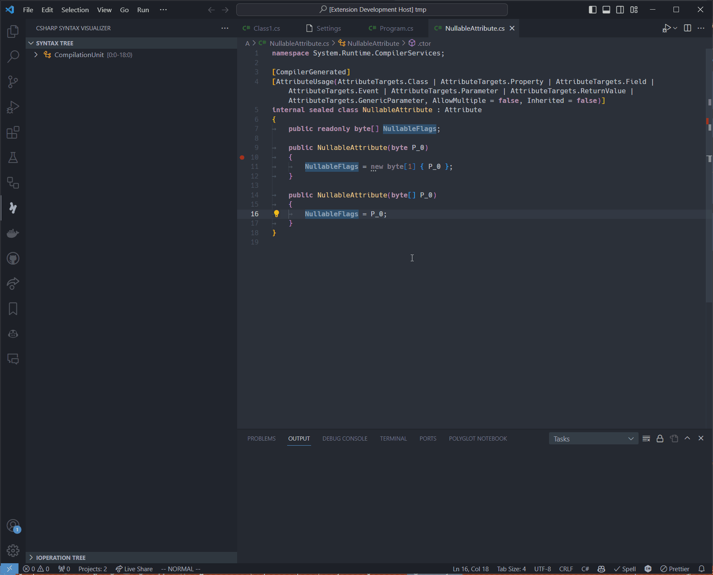

# .NET Compiler Developer SDK

The .NET Compiler Developer SDK is an extension to the standard C# experience in VSCode, providing tools for working with the Roslyn compiler.

## Features

### Syntax Visualizer

Visualize the syntax in a C# file live, as you type, and navigate around the structure interactively.

## Requirements

This extension depends on the [C# extension](https://marketplace.visualstudio.com/items?itemName=ms-dotnettools.csharp).

## Extension Settings

TODO

## Known Issues

TODO

## Release Notes

TODO
