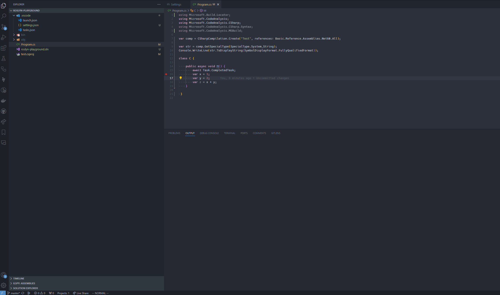

# .NET Compiler Developer SDK

The .NET Compiler Developer SDK is an extension to the standard C# experience in VSCode, providing tools for working with the Roslyn compiler.

## Features

### Syntax Visualizer

Visualize the syntax in a C# file live, as you type, and navigate around the structure interactively.

### IOperation Visualizer

Visualize the symbol and IOperation trees in a C# file live, as you type, and navigate around the structure interactively.

### IL and C# Decompilation

Visualize the IL and decompiled C# for your code live in the editor. The decompiled C# view shows a much lower-level than most C#: for example, async state machines
are decompiled

Big thanks to @ashmind and [Sharplab.io](https://sharplab.io) for both the idea and some of the settings for ICsharpCode.Decompiler!

## Requirements

This extension depends on the [C# extension](https://marketplace.visualstudio.com/items?itemName=ms-dotnettools.csharp).

## Extension Settings

* `"compilerdevelopersdk.enableSyntaxVisualizer"` - Turn on or off the C# Syntax Visualizer (defaults to on).
* `"compilerdevelopersdk.enableIOperationVisualizer"` - Turn on or off the C# IOperation Visualizer (defaults to on).
* `"compilerdevelopersdk.syncCursorWithTree"` - Reveal the tree node of the cursor location when clicking in a C# file (defaults to on).
* `"compilerdevelopersdk.verboseLogging"` - Turn on or off extra logging for troubleshooting purposes (defaults to off).

## Known Issues

* Top-level statements reveal in the IOperation tree isn't always as specific as it could be.
* Attempting to use the IL visualizer outside of a method or type causes an error.
* Metadata from references that aren't on disk (like other projects) is not found during decompilation.

## Release Notes

### 0.4.0

* Add initial build of IL Visualization

### 0.3.0

* Update to react to breaking changes in the C# extension APIs.

### 0.2.0

* Added IOperation Visualization support. You can now view IOperation nodes similarly to how you view syntax nodes, with a new dedicated view
  in the same panel.
* Reorganized the settings, and moved location highlighting from a setting to a toggleable action for each tree visualizer.
* Removed the properties pane. You can now view both syntax properties and IOperation properties as a subnode of a given syntax or IOperation node.
* Fixed several ID tracking bugs.
* Fixed several position tracking annoyances while typing.

### 0.1.2-prerelease

* b4cda2a Implement feature request: sync the cursor position when clicking in the tree view and reveal the location if offscreen.
* b804ffb Add verbose logging option.
* 10ae84f Only fire a text document changed tree refresh if the document is a C# file.

### 0.1.1

* 4c2e3f3 Correct conditional display of the syntax visualizer, and contribute the setting for disabling it.
* d60da59 Only request the node at the current location if the file type is C#.
* 1e5f735 Add extension startup logging.

### 0.1.0
- First prerelease
